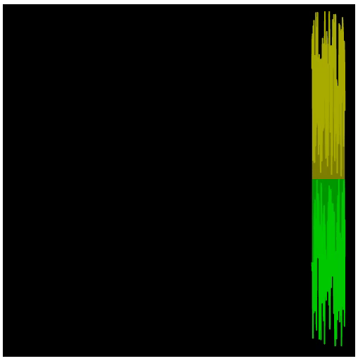

<h1 align="center">VolumeWave</h1>


### 基于JS+Canvas(canvas)、highcharts开发音量波形的实时音量电平值刷新展示。

- 音量波形根据音量值进行移动累加展示。
- 音量波形分为 **highcharts** 版本和 **canvas** 版本。
- 由于 **highcharts** 加载性能问题，故开发canavs版本作为展示。
-  **highcharts** ：目前展示效果较好，但是只作为展示其他多余方法冗杂，会造成性能问题。
-  **canvas** ：目前存在展示点数过多，如果宽度不够会显示模糊重影等问题，后续版本解决。
- js引入方式则需注掉export default 等导出方法。
- import 引入需使用export 导出使用。

### highcharts使用方法

```html
<head>
    <link href="./css/highCharts.css" type="text/css" rel="stylesheet" />
    <script src="./js/highCharts.js"></script>
    <style>
        #myCharts{
            width: 500px;
            height: 500px;
            background-color: #000;
        }
    </style>
</head>
<body>
    <div id="myCharts"></div>
    <script src="./js/VolumeWave.js"></script>
    <script>
        let volumeWave = new VolumeWave(Highcharts,'myCharts')
        setInterval(()=>{
            let data = []
            data.push([...new Array(100).keys()].map(a=>Math.random()*96))
            data.push([...new Array(100).keys()].map(a=>Math.random()*96))
            volumeWave.setVolumeVal(data)
        },1000)
    </script>
</body>
```
#### 配置项
```javascript
let volumeWave = new VolumeWave($1,$2)
//*$1(highcharts) ：指highcharts实例对象。
//*$2(parentId) :指生成canvas画布的父标签ID（结构需手动写入）。

//设置方法
//设置音量值，音量值二维数组 [[1,2,3,4],[4,5,6,7]],即上层、下层数据。
setVolumeVal(Val)
```

<h3 align="center">示例</h3>

<p align="center">
    
</p>

### canvas使用方法

```html
<head>
    <style>
        #canvasArea {
            width: 500px;
            height: 500px;
            background-color: #000;
        }
    </style>
</head>

<body>
    <div id="canvasArea">
    </div>
    <script src="./js/VolumeWaveCanvas.js"></script>
    <script>
        let volumeWave = new VolumeWave('canvasArea','canvas')
        setInterval(() => {
            volumeWave.setVolumeVal([[...new Array(100).keys()].map(i=>Math.ceil(Math.random()*-95)),[...new Array(100).keys()].map(i=>Math.ceil(Math.random()*-95-1))])
        },1000);
    </script>
    <script>
    </script>
</body>
```
#### 配置项
```javascript
let volumeWave = new VolumeWave($1,$2,$3)
//*$1(parentId) :指生成canvas画布的父标签ID（结构需手动写入）。
//*$2(canvasId) ：指生成canvas标签ID（无需写入,组件内部生成）。
//$3(charCount) ：指画布节点数，1音量值为一节点，如要展示1000个音量值，则为1000，默认值为1000。

//组件内部对音量值做了映射。
//设置方法
//设置音量值，音量值二维数组 [[1,2,3,4],[4,5,6,7]],即上层、下层数据。
setVolumeVal(Val)
```

<h3 align="center">示例</h3>

<p align="center">
    
</p>

演示效果请移步canvas、highcharts文件夹